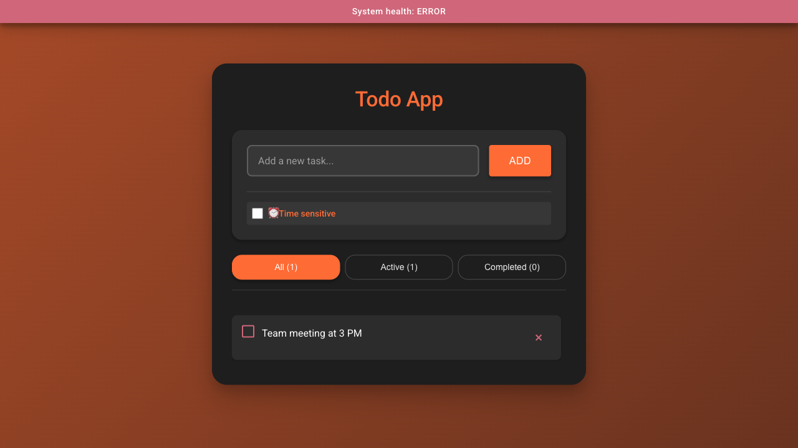
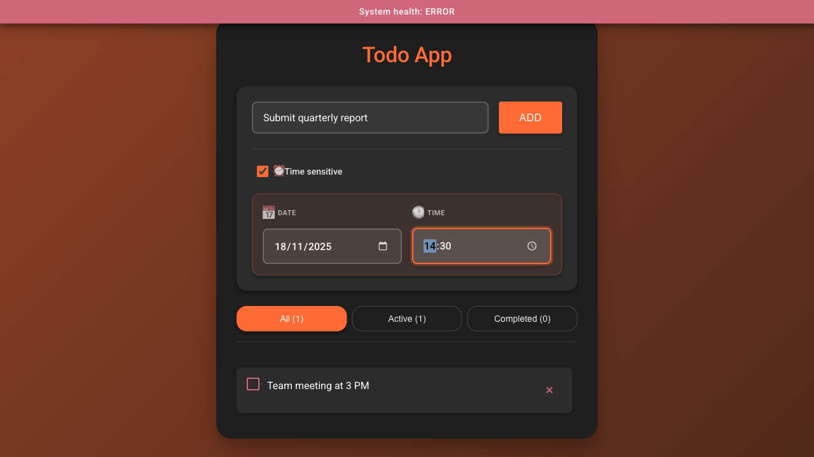
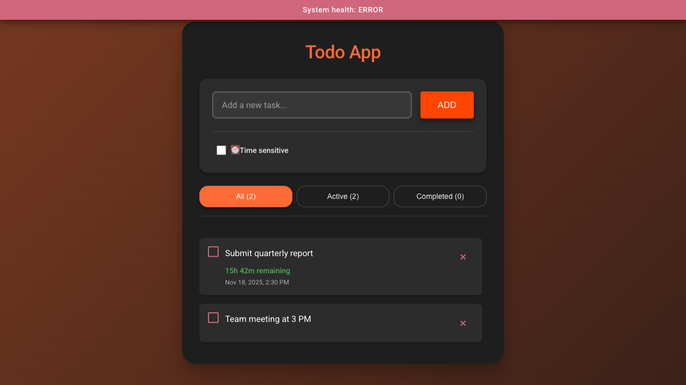
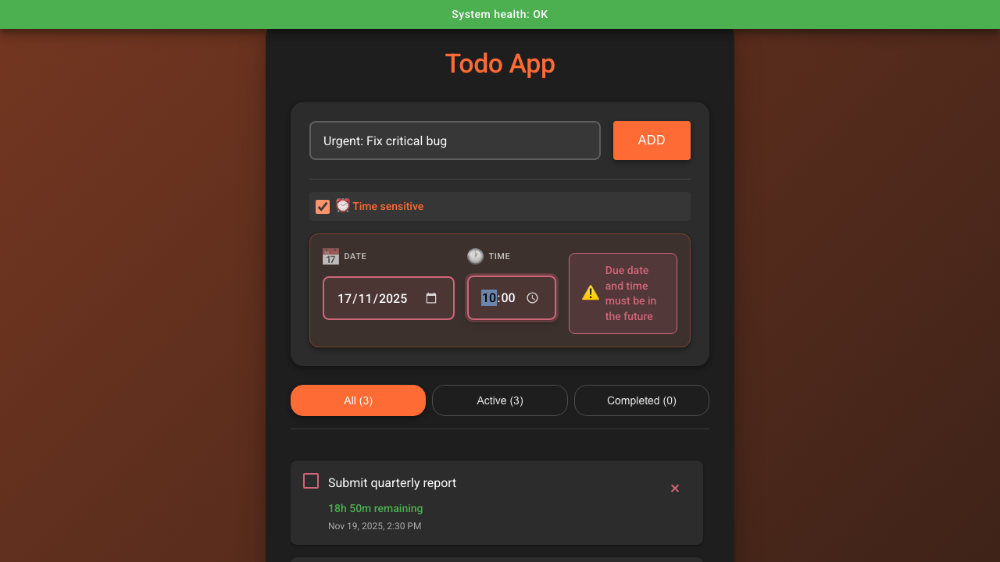
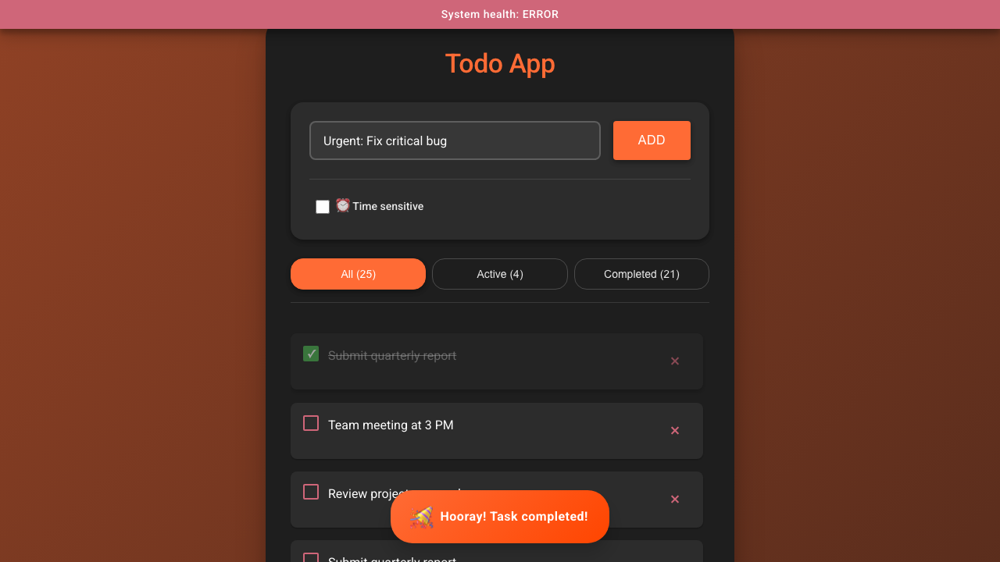
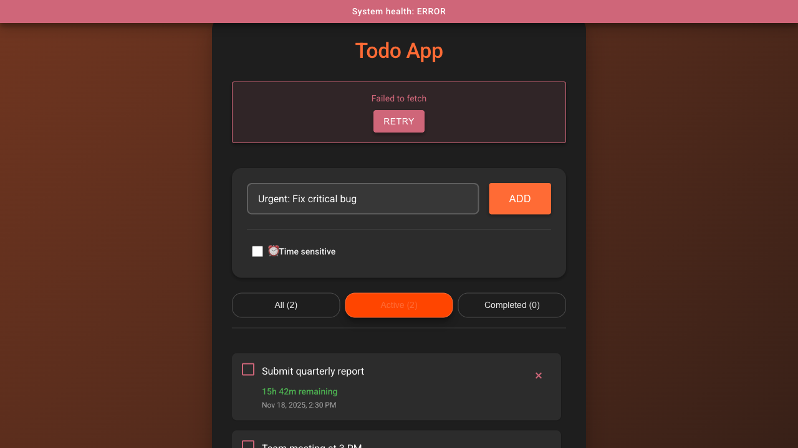
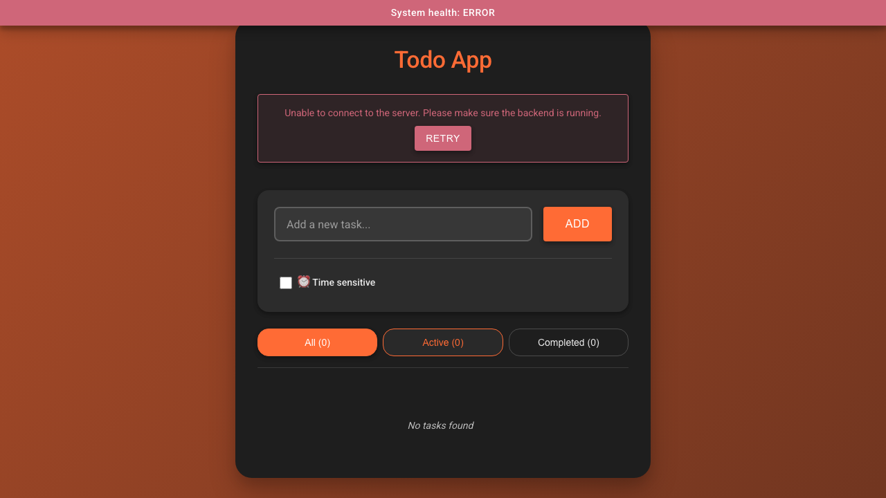
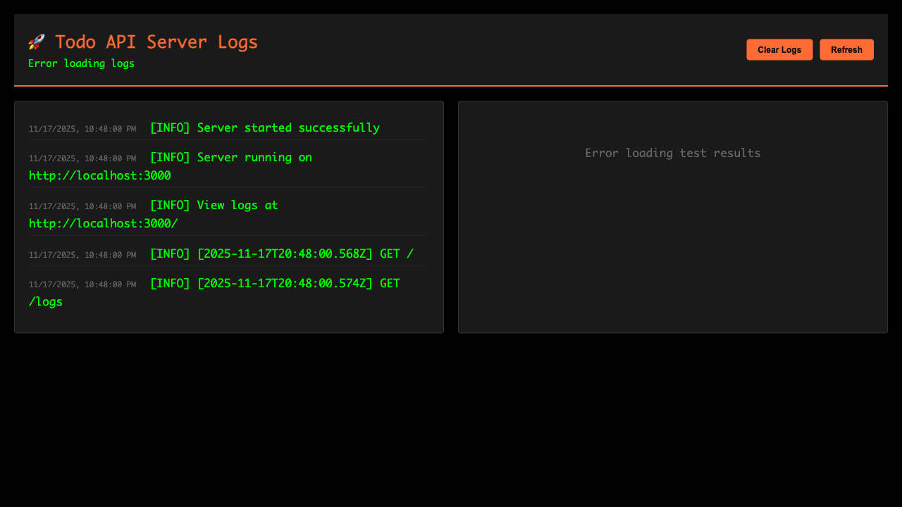

# Todo App

A full-stack todo application with React frontend and Express backend, featuring **Material Design UI**, comprehensive testing, real-time monitoring, and CI/CD integration.

## Screenshots

### Main Interface

*Clean Material Design interface with task list, filters, and time-sensitive task creation*

### Time-Sensitive Task Creation

*Android-style date/time picker with validation - shows date and time selection with real-time error feedback*

### Task with Countdown

*Active task displaying remaining time countdown and full due date/time information*

### Overdue Task Highlighting

*Overdue tasks highlighted in red with warning icon and "Overdue" status*

### Celebration Toast

*Animated celebration toast appearing when a task is marked as completed*

### Filter Functionality

*Material Design chip filters showing All/Active/Completed with live counts*

### System Health Banner

*System health indicator at the top showing backend connection status*

### Backend Dashboard

*Backend server dashboard showing logs and test results in real-time*

---

**Note**: Screenshots are automatically generated using Playwright. To regenerate them, run `npm run screenshots` (requires both frontend and backend servers to be running).

## Features

### Frontend

#### Core Functionality
- ✅ **Add new tasks** with real-time validation
- ✅ **Toggle task completion** with visual feedback
  - Celebration toast animation when task is marked as done
  - "Hooray! Task completed!" message with party emoji (🎉)
  - 5-second animated toast with slide-up, bounce, and slide-down animations
- ✅ **Delete tasks** with confirmation
- ✅ **Filter tasks** (All / Active / Completed) with live counts
  - Counts verified to match actual task states
  - Real-time count updates after operations
  - Visual filter indicators (Material chips)

#### Time-Sensitive Tasks
- ✅ **Android-style date/time picker**
  - Material Design date/time inputs with clear labels
  - Separate "DATE" and "TIME" labels with icons (📅 🕐)
  - Grouped layout with visual separation
  - Large touch targets (56px height) for better usability
  - Enhanced focus states with elevation and shadows
  - Responsive design (stacks vertically on mobile)
- ✅ **Real-time countdown** display
  - Updates every minute automatically via `useEffect` hook
  - Formatted display: "2d 5h remaining", "30m remaining", or "Overdue"
  - Full due date/time shown below countdown
  - Color-coded: Green for active, Red for overdue
- ✅ **Overdue detection** and highlighting
  - Material error color border and background for overdue tasks
  - Warning icon (⚠️) indicator
  - Automatic detection based on current time
- ✅ **Smart display logic**
  - Due date info hidden for completed tasks
  - Countdown only shown for active tasks with due dates
  - Proper text wrapping and content sizing

#### User Interface
- ✅ **Material Design 3** implementation
  - Material color system with CSS variables
  - Material elevation system (1dp, 2dp, 4dp, 8dp, 16dp)
  - Material typography (Roboto font family from Google Fonts)
  - Material spacing (8dp grid system)
  - Material motion curves (standard, decelerate, accelerate)
- ✅ **Material components**
  - Material Cards with elevation and hover effects
  - Material Text Fields with visible borders and backgrounds
  - Material Contained Buttons with elevation and uppercase text
  - Material Chips for filters (rounded, with active states)
  - Material Icon Buttons (circular delete button, 40px)
  - Material Checkboxes with smooth transitions
  - Android-style date/time pickers with labels
- ✅ **Visual design**
  - Animated gradient background (deep orange to black)
  - Centered card layout (max-width: 600px)
  - Smooth transitions and animations
  - Custom scrollbar styling
  - Responsive design for mobile devices
  - High contrast text for readability (#FFFFFF on dark backgrounds)
- ✅ **Enhanced UX**
  - Loading states during API calls
  - Error messages with retry functionality
  - Empty state messages
  - Hover effects on interactive elements
  - Touch-friendly button sizes (minimum 36px height, 56px for date/time inputs)
  - Proper text wrapping and content sizing
  - Clear visual hierarchy with proper spacing
  - **Celebration toast** for task completion
    - Animated slide-up entrance
    - Bounce animation
    - Icon spin and pulse effects
    - Auto-dismiss after 5 seconds
    - Material Design styling with gradient background

#### System Integration
- ✅ **System health banner**
  - Fixed top banner
  - Green (OK) or Red (ERROR) status
  - Polls `/health` endpoint every 5 seconds
  - Material snackbar-style design
- ✅ **Persistent storage** via REST API
- ✅ **Error handling** with friendly messages
- ✅ **Responsive design** for all screen sizes

### Backend
- ✅ RESTful API with Express
- ✅ JSON file persistence
- ✅ Request logging and monitoring
- ✅ Real-time logs dashboard at `http://localhost:3000/`
- ✅ Test results display on server page
- ✅ Input validation (empty titles, max length 500 chars, dueDate validation)
- ✅ Clear 4xx error messages with error codes
- ✅ CORS enabled for frontend communication
- ✅ Support for time-sensitive tasks with dueDate field

## Tech Stack

### Frontend
- **Framework**: React 18 with TypeScript
- **Build Tool**: Vite
- **State Management**: React hooks (useState, useEffect, useMemo)
- **UI Framework**: Material Design 3 principles
- **Typography**: Roboto font family (Google Fonts)
- **Styling**: CSS with Material Design variables, elevation system, and animations
- **Testing**: Playwright (E2E tests)
- **Design System**: 
  - Material Design color palette
  - 8dp grid spacing system
  - Material elevation shadows
  - Material motion curves

### Backend
- **Runtime**: Node.js with TypeScript
- **Framework**: Express
- **Testing**: Vitest + Supertest (API tests)
- **Storage**: JSON file-based persistence
- **Development**: Nodemon for auto-reload

## Project Structure

```
frontend-cursor-test2/
├── backend/
│   ├── src/
│   │   ├── server.ts              # Express server with all endpoints
│   │   ├── types/
│   │   │   └── Task.ts            # Task type definitions
│   │   └── utils/
│   │       ├── storage.ts          # JSON file persistence
│   │       ├── logger.ts           # Logging utilities
│   │       └── qaReportReader.ts   # QA report parser
│   ├── tests/
│   │   ├── api/
│   │   │   └── tasks.test.ts       # API test suite
│   │   ├── helpers/
│   │   │   ├── testServer.ts       # Test server helper
│   │   │   └── testData.ts         # Test data utilities
│   │   ├── reporters/
│   │   │   ├── qaReporter.ts       # QA report generator
│   │   │   └── vitestQAReporter.ts # Vitest reporter
│   │   └── setup.ts                # Test setup
│   ├── data/
│   │   ├── tasks.json              # Production data
│   │   └── tasks.test.json         # Test data (gitignored)
│   ├── package.json
│   ├── vitest.config.ts
│   └── tsconfig.json
├── src/
│   ├── components/
│   │   ├── TaskInput.tsx          # Material text field with Android-style date/time picker
│   │   ├── TaskItem.tsx            # Material list item with checkbox, due date display, and delete
│   │   ├── FilterButtons.tsx      # Material chip filters with live counts
│   │   ├── HealthBanner.tsx       # Material snackbar-style health indicator
│   │   └── CelebrationToast.tsx   # Celebration toast for task completion
│   ├── types/
│   │   └── Task.ts                # Task type definitions (with optional dueDate)
│   ├── utils/
│   │   ├── api.ts                 # API client functions (fetch, create, update, delete)
│   │   └── timeUtils.ts           # Time formatting and overdue detection utilities
│   ├── App.tsx                    # Main app component with state management
│   ├── App.css                    # Material Design component styles
│   ├── main.tsx                   # App entry point
│   └── index.css                  # Global styles with Material Design variables
├── tests/
│   ├── e2e/
│   │   └── todo.spec.ts           # Playwright E2E tests
│   ├── fixtures/
│   │   ├── backend.ts             # Backend test fixtures
│   │   └── testData.ts            # Test data fixtures
│   └── helpers/
│       └── pageHelpers.ts          # E2E test helpers
├── .github/
│   └── workflows/
│       └── test.yml               # CI/CD workflow
├── QA_REPORT.md                   # Auto-generated test report
├── package.json
├── playwright.config.ts
└── README.md
```

## Getting Started

### Prerequisites

- Node.js 20+ and npm
- Git

### Installation

1. **Clone the repository** (if applicable)
   ```bash
   git clone <repository-url>
   cd frontend-cursor-test2
   ```

2. **Install frontend dependencies**
   ```bash
   npm install
   ```

3. **Install backend dependencies**
   ```bash
   cd backend
   npm install
   cd ..
   ```

4. **Install Playwright browsers** (for E2E tests)
   ```bash
   npx playwright install chromium
   ```

### Running the Application

#### Development Mode

**Start the backend server:**
```bash
cd backend
npm run dev
```
Backend runs on `http://localhost:3000`

**Start the frontend (in a new terminal):**
```bash
npm run dev
```
Frontend runs on `http://localhost:5173`

#### Viewing Server Logs and Test Results

Visit `http://localhost:3000/` to see:
- **Left panel**: Real-time server logs
- **Right panel**: Unit test results organized by section/feature
- Auto-refreshes every 2 seconds

## API Endpoints

### Health & Monitoring

- `GET /health` - Returns `{ ok: true }`
- `GET /stats` - Returns task statistics: `{ total, active, completed }`
- `GET /logs` - Returns all server logs
- `GET /test-results` - Returns parsed test results from QA report
- `DELETE /logs` - Clears all logs

### Tasks

- `GET /tasks` - Get all tasks (sorted newest first)
- `POST /tasks` - Create a new task
  - Body: `{ title: string, dueDate?: number }`
  - Validation: Title required, max 500 chars, cannot be empty. dueDate optional timestamp (number)
  - Returns: Created task object
- `PUT /tasks/:id` - Update a task
  - Body: `{ title?: string, completed?: boolean, dueDate?: number | null }`
  - Validation: Title max 500 chars if provided. dueDate can be set, updated, or cleared (null)
  - Returns: Updated task object
- `DELETE /tasks/:id` - Delete a task
  - Returns: 204 No Content

### Error Responses

All endpoints return clear 4xx error messages with error codes:
- `400 Bad Request`: Invalid input (with error codes like `EMPTY_TITLE`, `TITLE_TOO_LONG`, `INVALID_TITLE_TYPE`)
- `404 Not Found`: Task ID doesn't exist
- `500 Internal Server Error`: Server errors

## Testing

### Running Tests

**Run all tests:**
```bash
npm test
```

**Run backend tests only:**
```bash
npm run test:backend
```

**Run frontend E2E tests:**
```bash
npm run test:ui          # Headless mode
npm run test:ui:headed   # With browser visible
```

### Test Coverage

#### Backend API Tests (Vitest + Supertest)
- ✅ GET /health
- ✅ GET /tasks (empty, sorted, fields validation)
- ✅ POST /tasks (create, validation: empty, whitespace, long titles, missing field, type validation)
- ✅ PUT /tasks/:id (toggle completion, validation, persistence)
- ✅ DELETE /tasks/:id (delete, 404 handling, persistence)
- ✅ GET /stats (counts by status)
- ✅ Integration: Full workflow

#### Frontend E2E Tests (Playwright)
- ✅ Display app
- ✅ Add task
- ✅ Toggle completion
- ✅ Delete task
- ✅ Persistence after refresh
- ✅ Filter by Active/Completed
- ✅ Filter counts verification (with timeout handling and state verification)
- ✅ Filter counts update after operations (add, toggle, delete)
- ✅ System health banner
- ✅ Full workflow (add → toggle → delete → refresh)
- ⏳ Time-sensitive task tests (future enhancement)

### Test Data Isolation

- Backend tests use `tasks.test.json` (separate from dev data)
- Tests automatically reset data before/after each test
- Frontend E2E tests reset backend data via fixtures

### Test Reliability Improvements

- **Timeout Handling**: E2E tests include explicit timeouts (5-10 seconds) for async operations
- **State Verification**: Filter count tests verify counts match actual displayed task states
- **Wait Strategies**: Tests use `waitForTimeout` and `waitForSelector` to handle state updates
- **Count Validation**: Filter counts are verified both by text content and by counting actual DOM elements

### QA Report

After running tests, `QA_REPORT.md` is automatically generated with:
- Test summary (total, passed, failed, skipped, pass rate)
- Individual test results with suggestions
- Organized by Backend API Tests and Frontend E2E Tests sections

## UI/UX Specifications

### Material Design Implementation

#### Color System
- **Primary Color**: `#FF6B35` (Deep Orange)
- **Primary Dark**: `#FF4500`
- **Primary Light**: `#FF8C65`
- **Surface**: `#1E1E1E` (Dark background)
- **Surface Variant**: `#2C2C2C` (Elevated surfaces)
- **On Surface**: `#FFFFFF` (Text on dark)
- **On Surface Variant**: `#B0B0B0` (Secondary text)
- **Error**: `#CF6679` (Material error color)
- **Success**: `#4CAF50` (Material success color)

#### Elevation System
- **1dp**: Subtle shadows for list items
- **2dp**: Cards and buttons at rest
- **4dp**: Hover states and active elements
- **8dp**: Main card elevation
- **16dp**: Maximum elevation for emphasis

#### Typography Scale
- **H1**: 2.125rem (34px) - Page title
- **H2**: 1.75rem (28px) - Section headers
- **H3**: 1.5rem (24px) - Subsection headers
- **Body1**: 1rem (16px) - Primary text
- **Body2**: 0.875rem (14px) - Secondary text
- **Caption**: 0.75rem (12px) - Helper text

#### Spacing (8dp Grid)
- All spacing uses multiples of 8px
- Component padding: 16px, 24px, 32px
- Gaps between elements: 8px, 16px, 24px
- Consistent margins throughout

#### Motion
- **Standard Curve**: `cubic-bezier(0.4, 0.0, 0.2, 1)` - Most transitions
- **Decelerate**: `cubic-bezier(0.0, 0.0, 0.2, 1)` - Entering animations
- **Accelerate**: `cubic-bezier(0.4, 0.0, 1, 1)` - Exiting animations
- Transition duration: 200ms for most interactions

### Component Specifications

#### Material Card
- Border radius: 24px
- Padding: 32px (desktop), 24px (mobile)
- Max width: 600px
- Elevation: 8dp (16dp on hover)
- Background: Material surface color

#### Material Text Field
- Visible borders (2px) with rounded corners (8px)
- Background: rgba(255, 255, 255, 0.05) for better text visibility
- Focus state: Primary color border with shadow glow
- Placeholder opacity: 50% with white color
- Smooth focus transitions
- Minimum height: 44px for better touch targets
- White text (#FFFFFF) for high contrast

#### Material Button
- Minimum height: 36px
- Uppercase text with letter spacing
- Border radius: 4px
- Elevation: 2dp (4dp on hover)
- Text transform: uppercase

#### Material Chips (Filters)
- Border radius: 16px
- Minimum height: 40px (improved for better touch targets)
- Padding: 10px 16px
- Active state: Primary color background with elevation
- Inactive state: Transparent with visible border (rgba(255, 255, 255, 0.2))
- Text: White text (rgba(255, 255, 255, 0.9)) for high contrast
- Hover: Border color changes to primary, background lightens

#### Material Checkbox
- Size: 20px × 20px
- Border radius: 2px
- Unchecked: Red border (#CF6679)
- Checked: Green background (#4CAF50) with white checkmark
- Smooth color transitions

#### Android-Style Date/Time Picker
- **Layout**: Grouped layout with separate date and time inputs
- **Labels**: Uppercase labels ("DATE", "TIME") with icons above inputs
- **Icons**: Calendar (📅) for date, Clock (🕐) for time
- **Input Size**: 56px height (Android Material standard)
- **Styling**: 
  - Rounded borders (8px)
  - Visible borders (2px) with white opacity
  - Background: rgba(255, 255, 255, 0.08)
  - Focus: Orange border with shadow and elevation
- **Container**: Card-like container with subtle orange background
- **Responsive**: Stacks vertically on mobile devices
- **Text**: White text (#FFFFFF) with medium font weight (500)

## Time-Sensitive Tasks Feature

### Overview
Tasks can optionally be marked as "time-sensitive" with a due date and time. This feature provides:
- Visual countdown showing remaining time
- Automatic overdue detection and highlighting
- Real-time updates (every minute)

### Usage
1. Click the "⏰ Time sensitive" checkbox when creating a task
2. Select a date and time using the Android-style date/time pickers:
   - **Date**: Click the date input labeled "DATE" with calendar icon
     - Minimum: Today (past dates are not allowed)
     - Maximum: 1 year from today (prevents dates too far in the future)
   - **Time**: Click the time input labeled "TIME" with clock icon
     - If today is selected, minimum time is 1 minute in the future
     - If a future date is selected, any time is allowed
3. Real-time validation:
   - Error messages appear if date/time is invalid
   - Visual indicators (red border) show invalid inputs
   - Form submission is blocked until valid date/time is selected
4. The task will display:
   - Remaining time (e.g., "2d 5h remaining", "30m remaining", "Overdue")
   - Full due date/time below the countdown
   - Red highlighting and warning icon if overdue

### Technical Details
- Due dates are stored as timestamps (milliseconds) in the `dueDate` field
- **Date Validation**:
  - Frontend: HTML5 `min` and `max` attributes restrict date picker selection
  - Frontend: Real-time validation checks date/time combination
  - Backend: Validates that due date is in the future (not in the past)
  - Backend: Validates that due date is not more than 1 year in the future
  - Error messages displayed with Material error styling
- Remaining time updates automatically every minute via `useEffect` hook
- Overdue tasks are highlighted with Material error color border and background
- Completed tasks don't show due date information
- Due dates can be updated or cleared (set to null) via the API
- Time formatting utilities handle days, hours, minutes, and seconds
- Date/time picker uses native HTML5 inputs with Material Design styling
- Labels and icons provide clear visual hierarchy (Android-style)
- Responsive layout adapts to mobile screens (stacks vertically)
- Inputs have 56px height for better touch targets (Android Material standard)
- Error messages animate in with slide-down effect

## Development

### Code Style

- 2 spaces indentation for TypeScript/JavaScript
- Meaningful variable and function names
- Small, focused components
- TypeScript for type safety
- Functional components with hooks
- Material Design principles for UI components
- CSS custom properties for theming
- 8dp grid system for spacing

### Design Principles

- **Material Design 3**: Follows Google's Material Design guidelines
- **Android-Style Components**: Date/time pickers match Android Material Design patterns
- **Accessibility**: 
  - Proper contrast ratios (white text on dark backgrounds)
  - Touch targets (minimum 36px, 56px for date/time inputs)
  - Clear visual hierarchy
  - Proper text sizing and wrapping
- **Responsive**: Mobile-first approach with breakpoints
- **Performance**: Optimized animations, lazy loading where applicable
- **Consistency**: Unified design system with CSS variables
- **Readability**: High contrast text, proper spacing, clear component sizing

### Data Persistence

- **Development**: Tasks stored in `backend/data/tasks.json`
- **Testing**: Tasks stored in `backend/data/tasks.test.json`
- Data persists across server restarts
- Test data is automatically cleaned up

### Environment Variables

- `NODE_ENV=test` - Enables test mode (uses test data file)
- `PORT` - Backend server port (default: 3000)

## CI/CD

### GitHub Actions

The project includes a GitHub Actions workflow (`.github/workflows/test.yml`) that:

- **Triggers**: On push/PR to main/master/develop branches
- **Backend Tests**: Runs Vitest + Supertest API tests
- **Frontend Tests**: Runs Playwright E2E tests
- **Artifacts**: Uploads Playwright traces on test failure
- **Status**: Shows test results in PR checks

## Monitoring & Debugging

### Server Dashboard

Visit `http://localhost:3000/` to access:
- **Real-time logs**: All API requests and operations
- **Test results**: Latest test run results organized by section
- **Auto-refresh**: Updates every 2 seconds

### Health Monitoring

- Frontend displays system health banner (green = OK, red = ERROR)
- Banner polls `/health` endpoint every 5 seconds
- Backend logs all operations with timestamps

## Error Handling

### Frontend
- Friendly error messages when API is down
- Retry button for failed operations
- Loading states during API calls

### Backend
- Clear 4xx error messages with error codes
- Detailed error logging
- Validation for all inputs

## Validation Rules

### Frontend Validation
- **Title**: Required, string type, trimmed, 1-500 characters
- **DueDate**: Optional, number type (timestamp in milliseconds)
  - Must be in the future (not in the past)
  - Cannot be more than 1 year in the future
  - Real-time validation with visual error indicators
  - Error messages displayed below date/time inputs
- **Filter Counts**: Automatically verified to match actual task states

### Backend Validation
- **Title**: Required, string type, trimmed, 1-500 characters
- **Completed**: Boolean type (when updating)
- **DueDate**: Optional, number type (timestamp in milliseconds), can be set to null to clear
  - Must be in the future (for new tasks)
  - Cannot be more than 1 year in the future
  - Past dates are rejected with clear error messages
- **Error Codes**: 
  - `EMPTY_TITLE` - Title is empty or whitespace-only
  - `TITLE_TOO_LONG` - Title exceeds 500 characters
  - `INVALID_TITLE_TYPE` - Title is not a string
  - `INVALID_DUE_DATE_TYPE` - DueDate is not a valid number
  - `DUE_DATE_IN_PAST` - Due date is in the past (not allowed for new tasks)
  - `DUE_DATE_TOO_FAR` - Due date is more than 1 year in the future

## Contributing

1. Follow the code style guidelines
2. Write tests for new features
3. Ensure all tests pass before submitting
4. Update QA_REPORT.md will be auto-generated

## License

ISC
